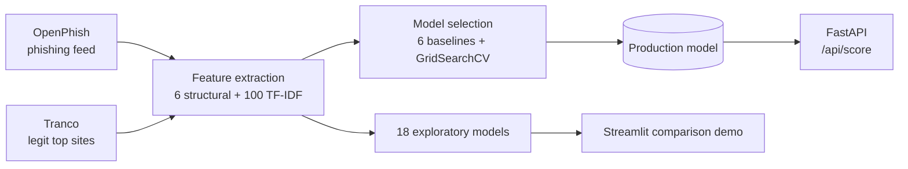
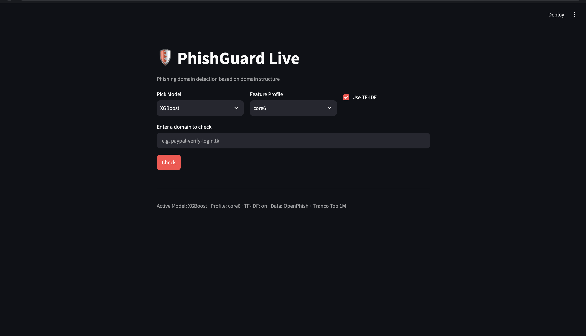

<div align="center">

# 🛡️ PhishGuard Live

**Phishing-domain detection trained on live public feeds, served through a REST API.**
A trained classifier with a full ML lifecycle, not a static dataset or an LLM wrapper.


</div>

## 📊 Results

| Metric | Value |
|---|---|
| ROC-AUC | **0.93** |
| F1 | **0.80** |
| Manual regression test (19 domains) | **89%** |
| Production model | Gradient Boosting, 106 features |

Decision threshold is **0.25, not 0.5**: missing a phishing domain costs more than a false alarm.
Full EDA, PCA and DBSCAN analysis: [`notebooks/eda.ipynb`](notebooks/eda.ipynb)

## 🧩 How it works



- **REST API**: one benchmarked production model, fixed threshold.
- **Streamlit**: 3 architectures × 3 feature profiles × with/without TF-IDF (18 variants) compared side by side. Not used by the API.
- **Features (106)**: length, digits, hyphens, brand similarity, suspicious TLD, phishing keywords + 100 character n-grams (TF-IDF).

## 🖥️ Live demo



*Streamlit app: pick a model architecture, feature profile and TF-IDF on/off, then score any domain.*


## 🚀 Quick start

```bash
uv sync
uv run app/_build_dataset.py
uv run app/_train_models.py
docker compose up --build        # API docs: http://localhost:8000/docs
```

Streamlit demo:
```bash
uv run app/_train_profiles.py    # one-time, trains the 18 variants
uv run streamlit run app/_streamlit_app.py
```

## 🔌 API usage

```bash
curl -X POST http://localhost:8000/api/score \
  -H "Content-Type: application/json" \
  -d '{"domain": "paypal-verify-login.tk"}'
```
```json
{"domain": "paypal-verify-login.tk", "prediction": "phishing", "phishing_probability": 0.94}
```

## 🔧 Engineering decisions

| Problem found | Fix | Outcome |
|---|---|---|
| **Shortcut learning**: model relied 66% on domain length alone | Expanded keyword/TLD config (crypto terms, free-hosting platforms) | Length share down to 55%, TLD and keywords now contribute |
| **Data artifact**: 22% of phishing domains had a stray `www.` prefix, legit almost none (TF-IDF accuracy inflated to 94.7%) | Stripped at the source, not only in features | Honest result: 89% |
| **Overfitting on benign domains**: `google.com` flagged as phishing | `max_features`, `subsample`, `reg_alpha`/`reg_lambda` | Random Forest false positive 63% → 40% |
| **Multi-segment TLD bug**: `pages.dev` never matched | `endswith("." + tld)` instead of last segment | `ledger-login.pages.dev` now caught (94%) |
| **Campaign leakage**: near-duplicate domains from one automated campaign | Documented, not yet fixed (split is not grouped by campaign) | Test scores may be optimistic |

## ⚠️ Known limitations

- Domain structure only: no WHOIS, no page-content analysis.
- Weak on generic phishing with no brand match and a safe TLD (e.g. `googl3.com`).
- `crt.sh` module implemented but excluded: frequent upstream outages.
- Training data varies run to run (live OpenPhish feed, ~200-360 examples).

## 📚 Config sources

[TLDs](https://www.cybercrimeinfocenter.org/top-20-tlds-by-malicious-phishing-domains) ·
[Brands](https://blog.checkpoint.com/research/which-brands-are-impersonated-most-inside-the-q2-2026-brand-phishing-report/) ·
[Keywords](https://expel.com/blog/top-phishing-keywords/)

## 🗂️ Project structure

```
app/                     # entrypoint scripts
├── _build_dataset.py
├── _train_models.py     # production model
├── _train_profiles.py   # 18 exploratory models
└── _streamlit_app.py
src/                     # library code: data/ features/ ml/ api/
config/                  # features.json, feature_profiles.json
notebooks/eda.ipynb
tests/
```

## ✅ Tests

```bash
uv run pytest -v
```